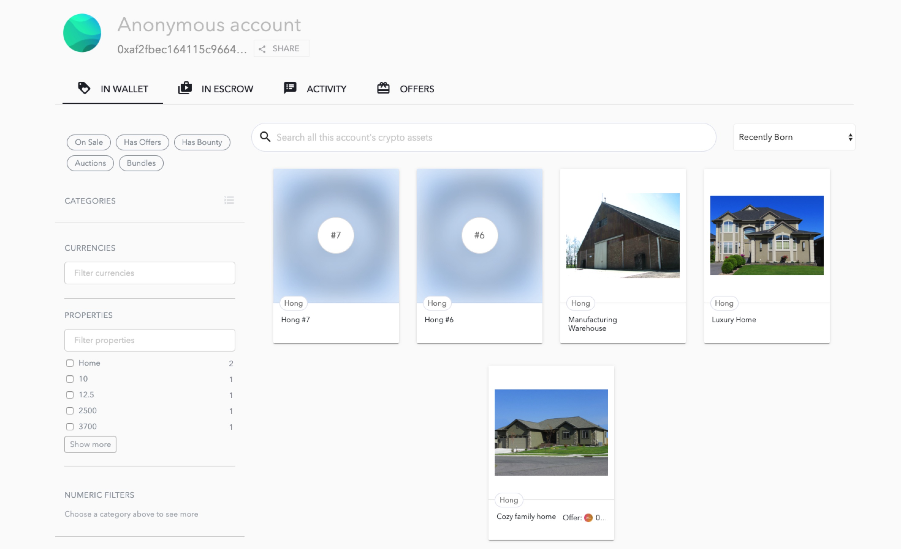

# RealEstateMarketplace

## Introduction

This project is building a real estate marketing Dapp based on etherum. The real estates are tokenized into ERC721. The front end client is generated using [OpenSea](https://docs.opensea.io/docs), which is a decentralized marketplace used for selling crypto assets. 

Besides this project uses zokrates to implement zero proof knowledge. The related code is in the directory `zokrates`. 

The contract is deployed in rinkeby testnet. 

The contract address is 
```
0x82EfdF9AaAd6e8B17ab316633b86336dE5897535
```

The example account is 

[https://rinkeby.opensea.io/accounts/0xaf2fbec164115c9664e21e4dca7702b880f99594](https://rinkeby.opensea.io/accounts/0xaf2fbec164115c9664e21e4dca7702b880f99594)

The account that bought the assets is 
[https://rinkeby.opensea.io/accounts/0x155ffa491f43e13cc20fea37d4a412696b962ca5](https://rinkeby.opensea.io/accounts/0x155ffa491f43e13cc20fea37d4a412696b962ca5)

## Compile and migrate the contract
Go to the `eth-contracts` directory
```shell
cd eth-contracts
npm install
truffle compile
truffle migrate
```
Note that by default, the contract is migrate to the `development` network (a.k.k the local blockchain usually created by ganache).

To test the contract 
```
truffle test
```

## Demo

